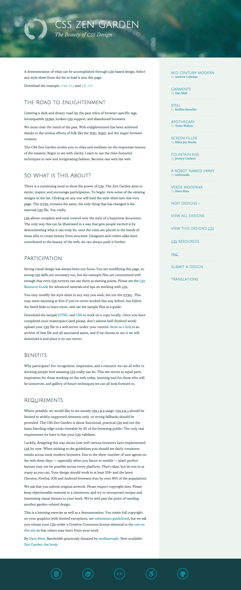

用 css (scss) 实现如下的页面效果，其中所需要的字体，图片等素材全部在 `styles` 文件夹中。



# 任务

请编辑 `styles/mystyle.scss` 文件，添加样式使其满足图片中以及以下的规格。

## 1. 布局

整个页面包含四个部分：页头，文本内容，侧边栏以及页脚。下面分别介绍一下各个部分的布局。

1. 页头高度为 `310px` 包含 `h1` `h2` 两个元素。左侧有整页宽度 `10%` 的间距。整个页头以 `huntington.jpg` 作为背景。
2. 文本内容与侧边栏构成两栏布局。左侧文本内容宽度为 `66%`，背景色为白色，文本块的缩进为 `48px 5% 48px 10%`。右侧边栏宽度为 `34%`，背景色为 `#edf4f0`，文本块缩进为 `48px 20% 48px 10%`。
3. 页脚宽度为 `100%`。

## 2. 字体排版

1. 页头中，`h1` 字体大小为 `3.2em` `h2` 字体大小为 `1.6em`。
2. 页脚采用 `verdemoderna` 的图标字体，居中，字体大小为 `70px`，每个图标为 `70px` 的正方形，注意设置 `line-height` 为 `1`。

## 3. 页头

1. 背景采用 `huntington.jpg`，背景居中，拉伸占满整个元素。
2. `h1` 左侧有一个采用 `enso.svg` 的图标，高度和宽度都为 `125px`，图标与右侧文本有 `40px` 的间距。`h1` 与 `h2` 之间有 `10px` 的间隔。

## 4. 页脚

1. 背景色为 `#134347`
2. 上下缩进 `48px` 
3. 图标居中，每个图标之间有 `48px` 的间隔

**注意** `styles` 文件夹中已经提供了 `basic.css` 等内容帮助提供默认的字体，请勿修改除 `styles/mystyle.scss` 外的其他文件。

# 预备知识

想要完成这个项目，你需要知道一个基本的 HTML 语法：

* 知道什么是 HTML 标签
* 知道一些基本的标签，比如 `div`
* 知道 html5 所引入的新的语义化标签，比如 `header` `aside` `footer`

你需要知道 CSS 的基本概念和语法：

* 什么是 CSS 选择器（selector）
* 如何对一个元素设置 `border` `margin` `width` `height`
* CSS 所支持的多种尺度：`px` `em` `%`
* 如何用 `class` 选择器对特定元素设置样式
* 什么是一个 html 元素的 `position`
* 什么是一个元素的 `display` 以及不同的 `display` 有什么样的效果
* 什么是浮动，如何清理浮动
* 如何采用浮动以及绝对定位修改页面的布局
* 如何用 css 添加一个背景图
* 如何使用 `::before` 元素在不修改 html 的前提下替换元素内容，如何采用 `position` 等设置它的位置
* 如何用 `text-indent` 隐藏元素文本内容

如果你采用 [`scss`](http://sass-lang.com/) 编写样式，还需要你知道一些 `scss` 的语法

并且，你需要知道一些 `git` 的基本使用方式：

* 知道如何 `clone` 远端的 `git` 仓库
* 知道如何将添加或者修改后的文件提交到本地 `git` 仓库
* 知道如何将本地的仓库提交到远端的仓库

还有，你可能需要知道一些 `nodejs`，`webpack`，`npm` 的知识，**不过在目前这个项目，这些不是必须的**：

* 知道什么是 `nodejs`
* 知道如何利用 `npm` 对 HTML Javascript 的项目进行依赖管理
* `webpack` 是做什么的，一个 `webpack.config.js` 文件都包含了哪些主要内容

# 搭建本地环境

为了构建这个项目，你需要至少将下面加 `*` 的东西安装到你的电脑上：

1. [`git`](https://git-scm.com/) `*`
2. `nodejs` 
3. `npm`

在项目目录下通过 `npm` 安装依赖

    $ npm install

通过 `npm` 命令启动本地开发环境

    $ npm run start

# 在本地执行测试

首先，这一步不是必须的。

按照下面的步骤安装必要的工具：

1. 安装 [node.js](https://nodejs.org/en/)
2. 安装 [PhantomJS](http://phantomjs.org/download.html)

然后执行以下命令安装其他依赖

```
$ npm install -g casperjs
$ npm install -g backstopjs
```

在本地执行测试

```
$ backstop test
```
