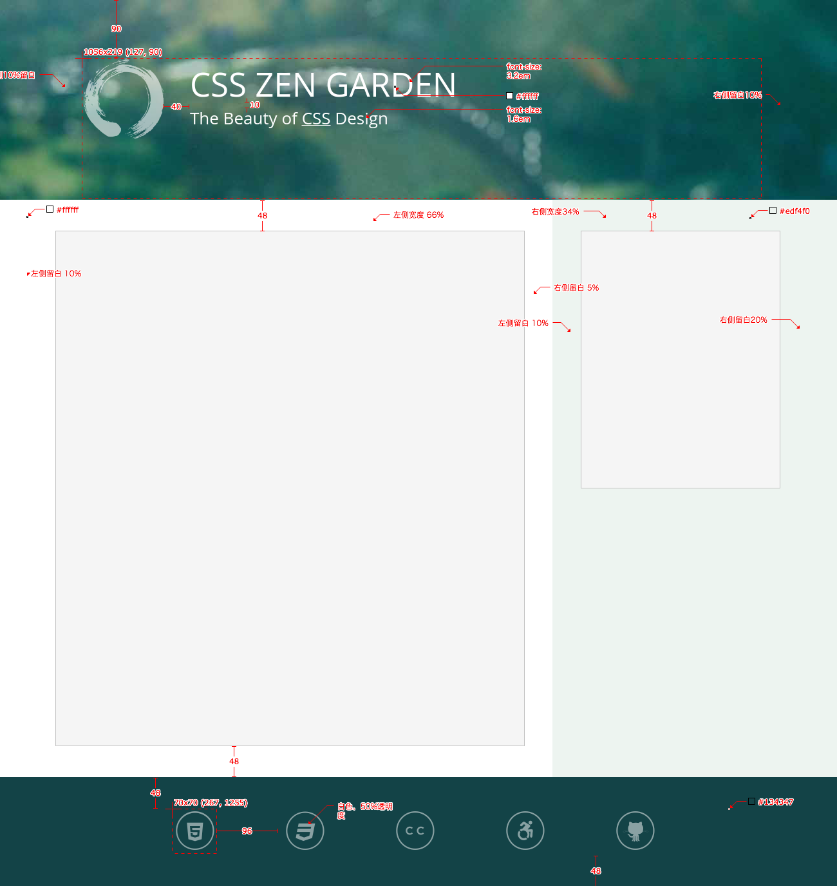

用 css (scss) 实现如下的页面效果，其中所需要的字体，图片等素材全部在 `styles` 文件夹中。



# 前提

想要完成这个项目，你需要知道一个基本的 HTML 语法：

* 知道什么是 HTML 标签
* 知道一些基本的标签，比如 `div`
* 知道 html5 所引入的新的语义化标签，比如 `header` `nav` `aside` `footer`

你需要知道 CSS 的基本概念和语法：

* 什么是 CSS
* 什么是 CSS 选择器（selector）
* 如何对一个元素设置 `border` `margin` `width` `height`
* CSS 所支持的多种尺度：`px` `em` `%`
* 如何用 `class` 选择器对特定元素设置样式
* 什么是一个 html 元素的 `position`
* 什么是一个元素的 `display` 不同的 `display` 有什么样的效果
* 什么是浮动，如何清理浮动
* 如何采用浮动以及绝对定位修改页面的布局
* 如何用 css 添加一个背景图
* 如何使用 `::before` 元素在不修改 html 的前提下替换元素内容
* 如何用 `text-indent` 隐藏元素文本内容

如果你采用 [`scss`](http://sass-lang.com/) 编写样式，还需要你知道一些 `scss` 的语法

并且，你需要知道一些 `git` 的基本使用方式：

* 知道如何 `clone` 远端的 `git` 仓库
* 知道如何将添加或者修改后的文件提交到本地 `git` 仓库
* 知道如何将本地的仓库提交到远端的仓库

还有，你可能需要知道一些 `nodejs`，`webpack`，`npm` 的知识，**不过在目前这个项目，这些不是必须的**：

* 知道什么是 `nodejs`
* 知道如何利用 `npm` 对 HTML Javascript 的项目进行依赖管理
* `webpack` 是做什么的，一个 `webpack.config.js` 文件都包含了哪些主要内容

# 环境

为了构建这个项目，你需要至少将下面加 `*` 的东西安装到你的电脑上：

1. [`git`](https://git-scm.com/) `*`
2. `nodejs` 
3. `npm`

# 构建

请编辑 `styles/mystyle.scss` 文件，添加样式完成测试。

## 布局

整个页面包含四个部分：页头，文本内容，侧边栏以及页脚。下面分别介绍一下各个部分的布局。

1. 页头高度为 `310px` 包含 `h1` `h2` 两个元素。左侧有整页宽度 `10%` 的间距。整个页头以 `huntington.jpg` 作为背景。
2. 文本内容与侧边栏构成两栏布局。左侧文本内容宽度为 `66%`，背景色为白色，文本块的缩进为 ``。右侧边栏宽度为 `34%`，背景色为 `#edf4f0`，距离页头有 `3em` 的间距。
3. 页脚宽度为 `100%`。

## 字体排版

1. 页头中，`h1` 字体大小为 `3.2em` `h2` 字体大小为 `1.6em`，斜体。
2. 行高为 `2`，`h3` 字体大小为 `1.8em`，字体为 'Julius Sans One`。
3. 侧边栏非链接文本为斜体，其中链接字体大小为 `1.2em`，字体为 'Julius Sans One'，大写。
4. 页脚采用 `verdemoderna` 的图标字体，居中，字体大小为 `60px`，每个图标为 `70px` 的正方形。

## 页头

1. 背景采用 `huntington.jpg`，背景居中，拉伸占满整个元素。
2. `h1` 左侧有一个采用 `enso.svg` 的图标，高度和宽度都为 `125px`，图标与右侧文本有 `40px` 的间距。

## 文本内容

1. 文本部分每个块的缩进为 `1em 5% 1em 10%`
2. `p` 上下间距为 `0.75em`
3. 整个文本部分上部与页头有 `3em` 的间距，下部与页脚有 `3em` 的间距

## 侧边栏

1. `li` 左右各有 `15%` `30%` 的缩进
2. `li` 之间有一个颜色为 `#d9e3dc` 的间隔线
3. `li` 的文本颜色为 `#c0cac3`

## 页脚

1. 背景色为 `#134347`
2. 上下缩进 `3em` 
3. 图标居中，每个图标之间有 `3em` 的间隔

# 在本地执行测试

首先，这一步不是必须的。

按照下面的步骤安装必要的工具：

1. 安装 [node.js](https://nodejs.org/en/)
2. 安装 [PhantomJS](http://phantomjs.org/download.html)

然后执行以下命令安装其他依赖

```
$ npm install -g casperjs
$ npm install -g backstopjs
```

在本地执行测试

```
$ backstop test
```
